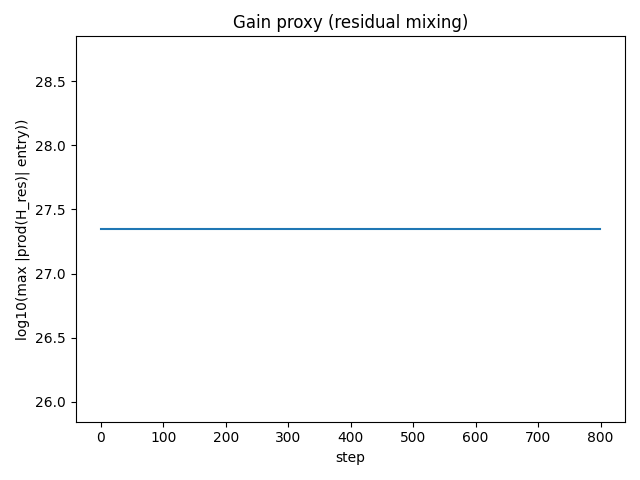
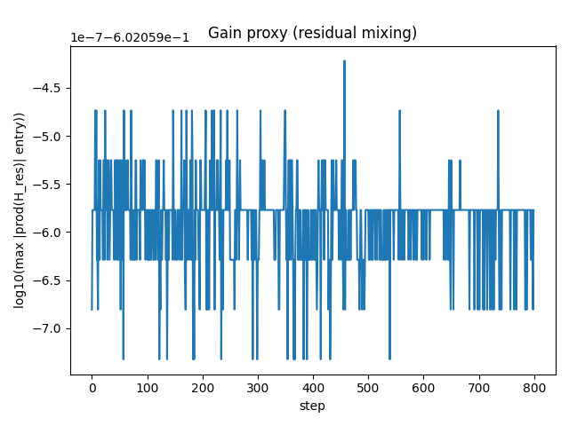
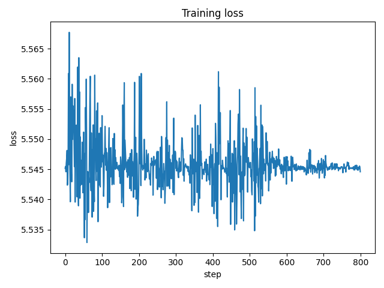
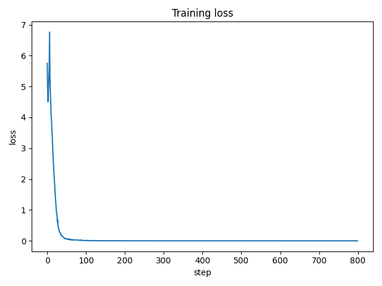

# mhc-demo

A minimal, correctness-first demo repo that **implements mHC (Manifold-Constrained Hyper-Connections)** and
shows its **stability benefits** under a depth stress-test.

Based on the paper: [arXiv:2512.24880](https://arxiv.org/abs/2512.24880)

- Phase 1: **MLX (Apple Silicon)** reference implementation.
- Phase 2: CUDA (HF/PyTorch; Unsloth optional depending on compatibility with forward-pass changes).

> This repo is intentionally small and explicit. Speed optimizations come after correctness.

## Prerequisites

- Python 3.10+
- [uv](https://github.com/astral-sh/uv) for fast dependency management

## Quick start (MLX)

### 1) Create an environment
```bash
uv venv
source .venv/bin/activate
uv pip install -r mlx/requirements.txt
```

### 2) Run a depth sweep
```bash
bash scripts/run_depth_sweep.sh
```

Outputs go to `runs/`:
- `metrics.jsonl` (one JSON per step)
- `config.json`
- `plots/*.png`

### 3) Compare runs
Open the plots:
- `loss.png`
- `grad_norm.png`
- `nan_inf_events.png`
- `gain_proxy.png`

## Repo map
- `docs/eli4-mHC.md` – simple explanation using analogies (start here)
- `docs/eli5-mHC.md` – technical explanation + how THIS repo implements mHC
- `docs/history.md` – evolution from sigmoid to ResNet to HC to mHC (with paper references)
- `mlx/src/` – MLX implementation (baseline / HC / mHC)
- `scripts/` – convenience scripts for running and plotting

## Results

Depth stress test comparing baseline, HC, and mHC at 12, 24, and 48 layers:

### Gain Proxy (log10 scale - lower is more stable)

| Depth | Baseline | HC | mHC |
|-------|----------|-----|------|
| 12L | 0.0 | 7.0 | -0.5 |
| 24L | 0.0 | 14.4 | -0.6 |
| 48L | 0.0 | **27.3** | **-0.6** |

HC's amplification explodes with depth (10^7 to 10^27), while mHC stays bounded at ~10^-0.6.

### Final Loss (lower is better)

| Depth | Baseline | HC | mHC |
|-------|----------|-----|------|
| 12L | 1.78 | 0.0001 | 0.002 |
| 24L | 1.86 | 0.0001 | 0.0002 |
| 48L | 3.79 | **5.54** | **0.0002** |

At 48 layers, HC becomes unstable (loss 5.54), while mHC converges perfectly (0.0002).

### 48-Layer Comparison

**HC 48L - Unstable gain growth:**



**mHC 48L - Bounded gain (doubly-stochastic constraint):**



**HC 48L - Training fails to converge:**



**mHC 48L - Clean convergence:**



## Notes
- The default dataset is a synthetic "incrementing token" task: sequences follow `(start + i) mod vocab`.
  This is learnable (unlike pure random tokens), trains fast, and is great for stability stress-testing.
- The most honest small-scale demo is **stability vs depth** (loss + grad spikes + NaNs), not SOTA accuracy.
