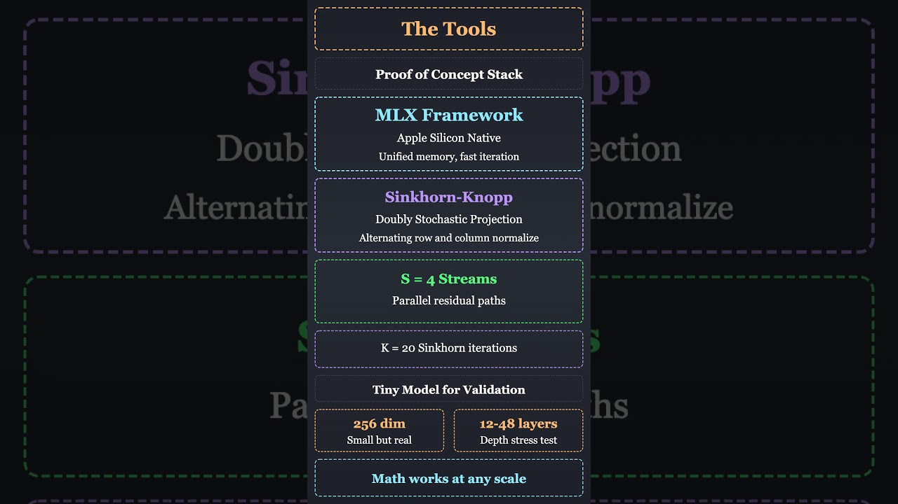
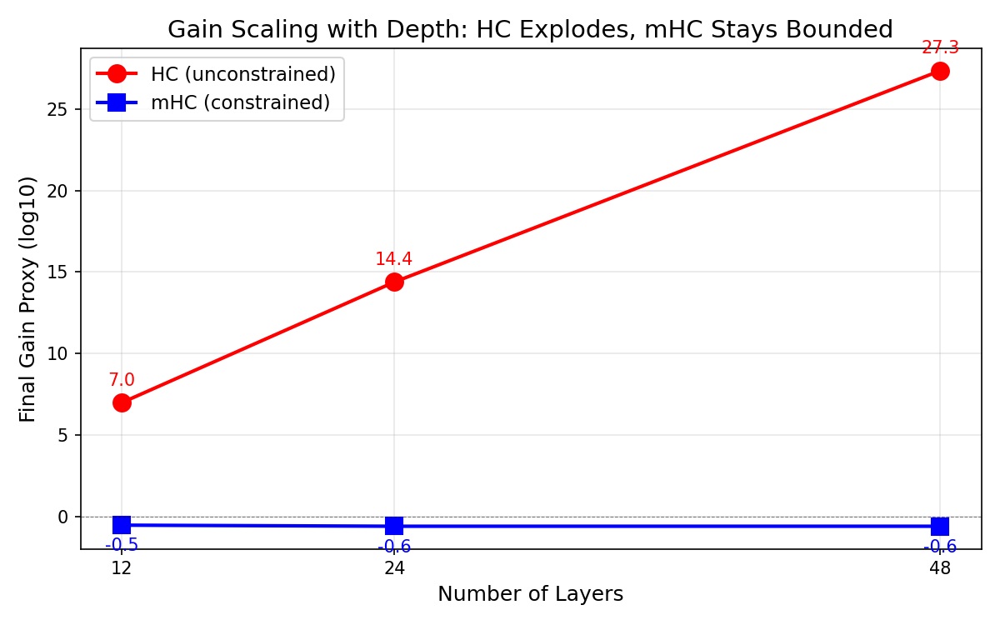
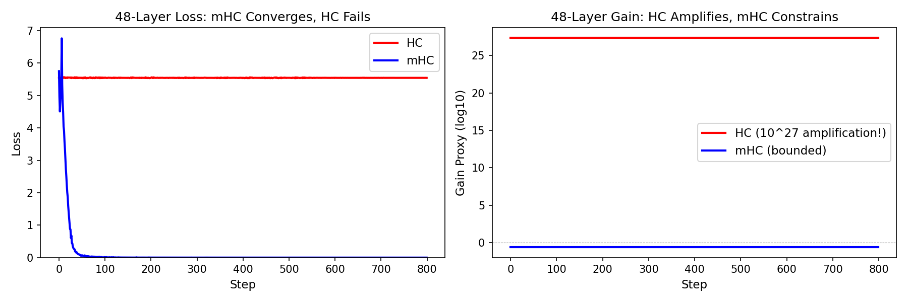
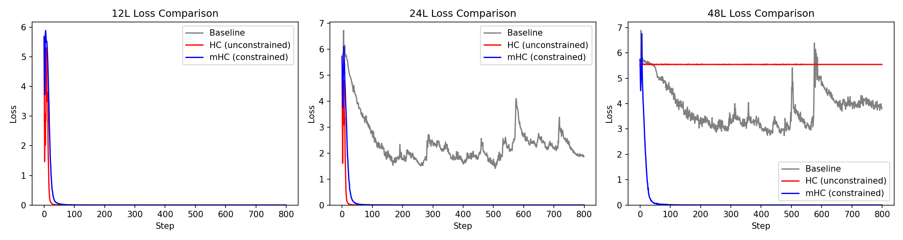
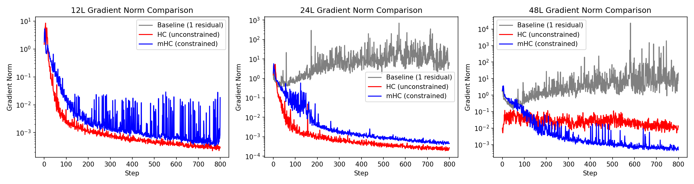

# mhc-demo

A minimal, correctness-first demo repo that **implements mHC (Manifold-Constrained Hyper-Connections)** and
shows its **stability benefits** under a depth stress-test.

Based on the paper: [arXiv:2512.24880](https://arxiv.org/abs/2512.24880)

[](https://www.youtube.com/shorts/fh21_zIK2ZE)

*Click to watch the YouTube Short*

- Phase 1: **MLX (Apple Silicon)** reference implementation.
- Phase 2: CUDA (HF/PyTorch; Unsloth optional depending on compatibility with forward-pass changes).

> This repo is intentionally small and explicit. Speed optimizations come after correctness.

## Prerequisites

- Python 3.10+
- [uv](https://github.com/astral-sh/uv) for fast dependency management

## Quick start (MLX)

### 1) Create an environment
```bash
uv venv
source .venv/bin/activate
uv pip install -r mlx/requirements.txt
```

### 2) Run a depth sweep
```bash
bash scripts/run_depth_sweep.sh
```

Outputs go to `runs/`:
- `metrics.jsonl` (one JSON per step)
- `config.json`
- `plots/*.png`

## Quick start (CUDA/PyTorch)

### 1) Create an environment
```bash
cd cuda
uv venv
source .venv/bin/activate
uv pip install -r cuda/requirements.txt
```

### 2) Verify CUDA
```bash
python -c "import torch; print(f'CUDA: {torch.cuda.is_available()}')"
```

### 3) Run the demo
```bash
python -m cuda.src.train --config cuda/configs/demo_mhc.yaml --out runs/cuda_demo
```

### 4) Run full depth sweep
```bash
bash scripts/run_cuda_depth_sweep.sh
```

See [cuda/docs/results.md](cuda/docs/results.md) for detailed CUDA results and [cuda/docs/comparisons.md](cuda/docs/comparisons.md) for cross-platform benchmarks.

## Compare runs (MLX)

Open the plots:
- `loss.png`
- `grad_norm.png`
- `nan_inf_events.png`
- `gain_proxy.png`

## Repo map
- `docs/eli4-mHC.md` – simple explanation using analogies (start here)
- `docs/eli5-mHC.md` – technical explanation + how THIS repo implements mHC
- `docs/history.md` – evolution from sigmoid to ResNet to HC to mHC (with paper references)
- `mlx/src/` – MLX implementation (baseline / HC / mHC)
- `cuda/src/` – CUDA/PyTorch implementation (baseline / HC / mHC)
- `cuda/docs/` – CUDA-specific documentation and results
- `scripts/` – convenience scripts for running and plotting

## Results (MLX)

Depth stress test comparing baseline, HC, and mHC at 12, 24, and 48 layers:

### Gain Proxy (log10 scale - lower is more stable)

| Depth | Baseline | HC | mHC |
|-------|----------|-----|------|
| 12L | 0.0 | 7.0 | -0.5 |
| 24L | 0.0 | 14.4 | -0.6 |
| 48L | 0.0 | **27.3** | **-0.6** |

HC's amplification explodes with depth (10^7 to 10^27), while mHC stays bounded at ~10^-0.6.

### Final Loss (lower is better)

| Depth | Baseline | HC | mHC |
|-------|----------|-----|------|
| 12L | 1.78 | 0.0001 | 0.002 |
| 24L | 1.86 | 0.0001 | 0.0002 |
| 48L | 3.79 | **5.54** | **0.0002** |

At 48 layers, HC becomes unstable (loss 5.54), while mHC converges perfectly (0.0002).

### Key Insight: Gain Scaling with Depth



**What this shows:** As we add more layers, HC's residual amplification grows exponentially (red line: 10^7 → 10^14 → 10^27), while mHC's doubly-stochastic constraint keeps amplification bounded near zero (blue line stays flat). This is the core benefit of mHC.

### 48-Layer Head-to-Head Comparison



**Left (Loss):** mHC (blue) converges rapidly to near-zero loss, while HC (red) is stuck at ~5.5 and never learns. **Right (Gain):** HC has 10^27 amplification that prevents learning; mHC stays bounded near zero.

### Loss Across All Depths



**What this shows:** At 12 layers (left), all variants converge. At 24 layers (middle), baseline struggles but HC/mHC still work. At 48 layers (right), only mHC (blue) converges - baseline (gray) oscillates and HC (red) flatlines at high loss.

### Gradient Norm Across All Depths



**What this shows:** Gradient norms reveal training health. At 48 layers (right), HC (red) shows erratic gradient behavior while mHC (blue) maintains stable gradients throughout training. The baseline (gray) shows gradients that decay but remain stable - the benefit of single-stream residuals without the expressiveness of multi-stream.

## Results (CUDA)

The CUDA/PyTorch implementation reproduces the MLX results. See [cuda/docs/results.md](cuda/docs/results.md) for full details.

### Quick Demo (24-layer mHC, 50 steps)

| Metric | Start | End | Change |
|--------|-------|-----|--------|
| Loss | 5.615 | 0.118 | -97.9% |
| Grad Norm | 0.747 | 0.106 | -85.8% |
| Gain Proxy | -0.602 | -0.602 | 0% |

### Cross-Platform Validation

| Metric | CUDA | MLX |
|--------|------|-----|
| Gain Proxy (24L mHC) | **-0.602** | **-0.6** |
| Gradient Stability | Stable | Stable |
| NaN Events | 0 | 0 |

Identical gain proxy values confirm the Sinkhorn-Knopp doubly-stochastic projection is correctly implemented on both platforms.

## Notes
- The default dataset is a synthetic "incrementing token" task: sequences follow `(start + i) mod vocab`.
  This is learnable (unlike pure random tokens), trains fast, and is great for stability stress-testing.
- The most honest small-scale demo is **stability vs depth** (loss + grad spikes + NaNs), not SOTA accuracy.
